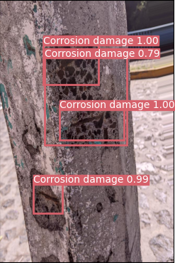

# CONCORNET2023 (Corrosion Damage on Concrete Structures Image Dataset) 🧑‍🏫

## Description: 📝
This repository stores an image dataset about corrosion damage on concrete structures.

## Dataset Title: 👌
CONCORNET2023: Corroded concrete Image dataset for machine learning and deep learning applications.

## Researchers 🧑‍🔬
- *Dr. José A. Guzmán-Torres*  
jose.alberto.guzman@umich.mx  
https://orcid.org/0000-0002-9309-9390

- *Dr. Francisco J. Domínguez-Mota*  
francisco.mota@umich.mx  
https://orcid.org/0000-0001-6837-172X
- *Dr. Gerardo Tinoco-Guerrero*  
gerardo.tinoco@umich.mx  
https://orcid.org/0000-0003-3119-770X

Universidad Michoacana de San Nicolás de Hidalgo, Faculty of Civil Engineering  
AULA-CIMNE, Morelia

## Project summary, description or abstract: 📚
CONCORNET2023 is a labeled image dataset for training, testing, validation, and benchmarking of artificial intelligence-based corrosion detection algorithms for concrete structures.

CONCORNET2023 contains 790 photographs of concrete structures with signs of corrosion problems. The photos are related to various concrete structures such as columns, beams, slabs, and others.

The dataset includes different levels of corrosion damage and photographs with a variety of perturbations, including channel shift, horizontal flip, horizontal shift, random rotation, and random zoom.

CONCORNET2023 will come in handy for the continued development of concrete corrosion detection tasks on algorithms based on deep learning, which is a field that is gaining momentum in Civil Engineering applications. 

## Description of files: ✍️
The repository contains a directory named Images, which contains the corrosion images on concrete structures in three sub-directories, train (632), test(79), and val (79). All the images are two-dimensional color images with .jpg extension.

Also, this repository stores a file named best.pt, which contains the computed weights using the YOLOv3 framework (ultralytics/yolov3) by the authors. The retrieved weights are parameters related to the employment of CONCORNET2023.  

## Definition of acronyms: ✨
CONCORNET2023: Concrete Corrosion Network 2023.

## Please cite the following paper if you use this dataset in your research:

@article{guzman2023damage,  
author = {Guzm{\'a}n-Torres, Jos{\'e} A and Dom{\'\i}nguez-Mota, Francisco J and Mart{\'\i}nez-Molina, Wilfrido and Naser, MZ and Tinoco-Guerrero, Gerardo and Tinoco-Ru{\'\i}z, Jos{\'e} G},  
title = {Damage Detection on Steel-Reinforced Concrete Produced by Corrosion via YOLOv3; A detailed guide},  
journal = {Frontiers in Built Environment},  
volume = {9},  
pages = {41},  
year = {2023},  
publisher={Frontiers}  
doi = {https://doi.org/10.3389/fbuil.2023.1144606},  
URL = {https://www.frontiersin.org/articles/10.3389/fbuil.2023.1144606/full},  
}
